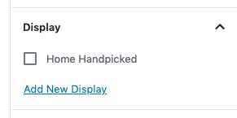

# Mai Display Taxonomy
Creates a private "Display" taxonomy for use with Mai Post Grid block.

## Example
1. Create a Display term called "Home Handpicked".
1. Select some posts and add them to Home Favorites term via the post edit screen or by bulk edit.
1. (v2 Mai Themes) Add a Mai Post Grid block and in the “Entries” tab, get entries by Taxonomy and configure it to use the Display taxonomy with posts in the Home Handpicked category
1. (v1 Mai Themes) Use the following shortcode to display the selected posts on your homepage.
```
[grid content="post" taxonomy="mai_display" tax_field="slug" terms="home-handpicked"]
```
1. Optionally choose other post types like Pages, Products, Portfolio items, etc. to use the Display taxonomy with. Settings are in Dashboard > Mai Theme > Display Taxonomy.

## Screenshots
**The Display taxonomy menu item and page.**<br>
<br>
**The Display taxonomy metabox (works with Classic Editor and Gutenberg block editor).**<br>
<br>
